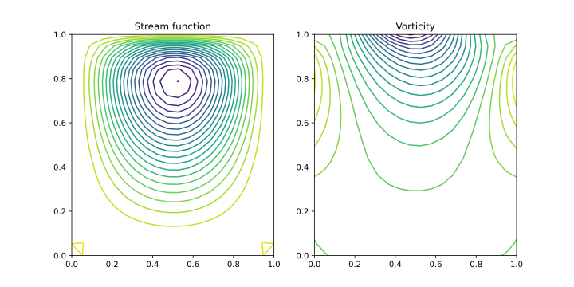
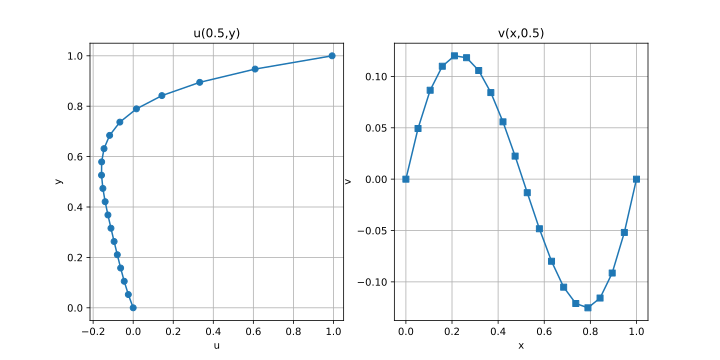
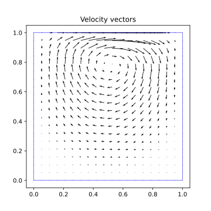

# Lid driven cavity using Vorticity-Stream function formulation

> There is also a Chapel version of this which is more sophisticated.

## Stream function solver

Set the grid size and test the stream function solver

```bash
julia test_stream.jl
```

We obtain a plot like this

<p align="center">

</p>

## Lid-driven cavity

To run the lid-driver cavity code

```bash
julia main.jl
```

The solution at the end is shown below.

<p align="center">

</p>

<p align="center">

</p>

<p align="center">

</p>
